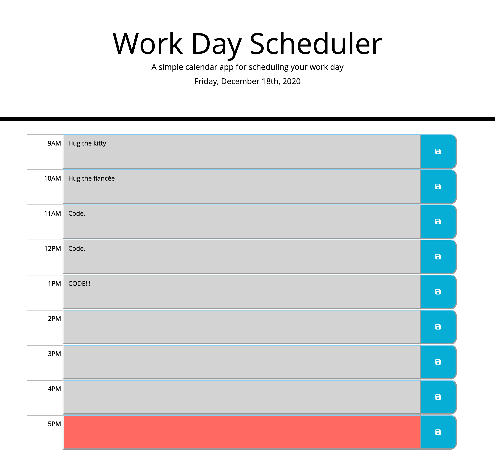

# Work Day Scheduler
UW Bootcamp assignment: Work Day Scheduling app

## About the Author

Timothy M. Keller is a web developer and musician residing in Seattle, WA.

Email: timothy.m.keller@gmail.com

Github: https://github.com/tmkeller

LinkedIn: https://linkedin.com/in/tim-keller-3ab55bb1/

## Features

An interactive daily scheduling app with the following features:

* Persistent state through localStorage allows the app to maintain entries after reloading.
* Attractive, navigable interface.
* Uses bootstrap columns and containers to create an interface that functions and displays properly at any screen width.
* Makes use of JQuery at every opportunity.
* Uses CSS border-style combined with JQuery functions to create the illusion of buttons that depress like a real-world object!
* JQuery hover function that allows svg icons to change color.
* Table row that changes color depending on the time of the day, showing the user where they should be in their schedule.

## Product

[Live Site URL](https://tmkeller.github.io/workday-scheduler/)

## Technologies

## License

[CC0 1.0 Universal](https://creativecommons.org/publicdomain/zero/1.0/)